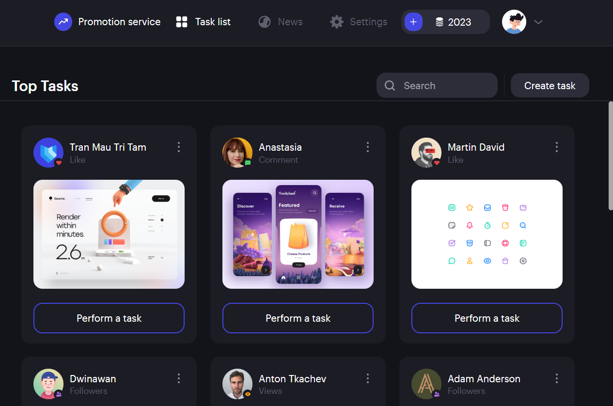

# Promotion service

## Deploy

https://promotion-service.netlify.app

## Prerequisites

- Git - [Download & Install Git](https://git-scm.com/downloads).
- Node.js - [Download & Install Node.js](https://nodejs.org/en/download/) and the npm package manager.

## Downloading

```
git clone {repository URL}
```

## Installing

```
1. yarn install (npm modules installing)
2. yarn start
```

## Screenshot



## Figma

https://www.uistore.design/items/web-service-free-ui-kit-for-figma/
